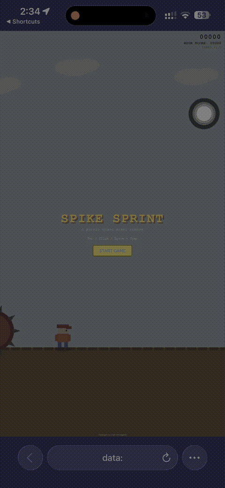
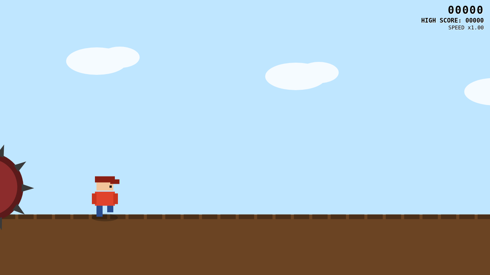
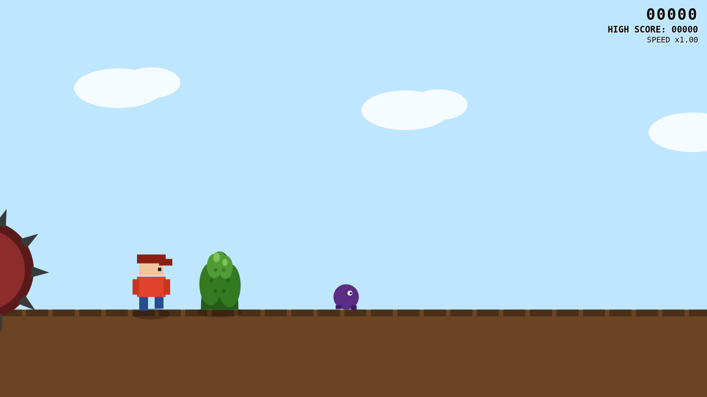
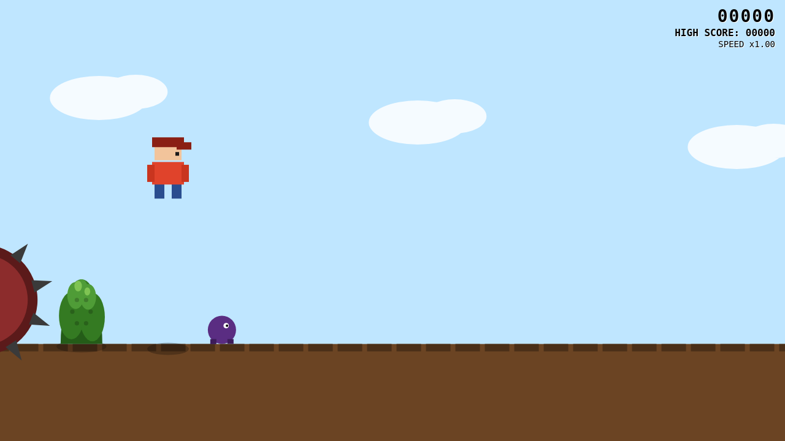
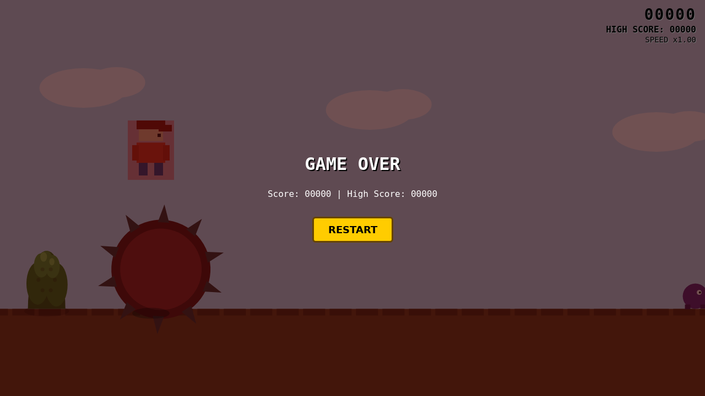
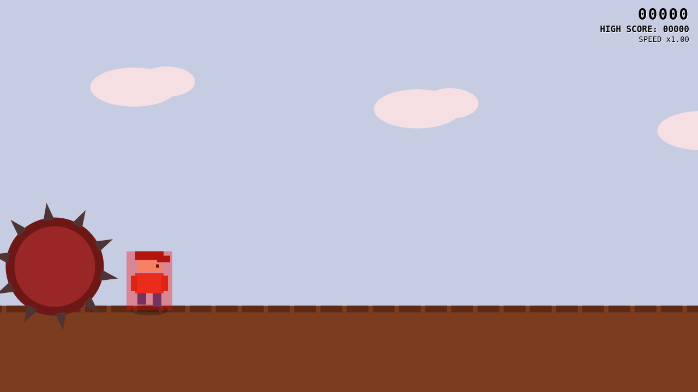
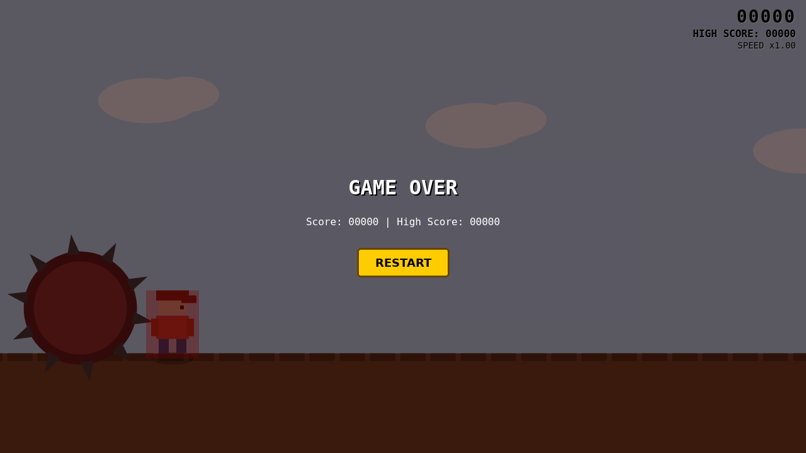

# Spike Sprint

*A poorly coded pixel runner*

A browser-based endless runner game built with vanilla JavaScript and HTML5 Canvas — no external dependencies or libraries. All visuals (character, enemies, barrel, bushes) are original artwork drawn procedurally in code.

## Origin Story

I was on a flight — no wifi, phone at 80%, and no in-flight entertainment system to save me. After landing, I said no more. A few days later, this game existed. It runs 100% offline (naturally), so next time you're stuck somewhere with no signal, you can be productively bored too.

## Play It

Open `index.html` directly in any modern browser (Chrome recommended), or enable GitHub Pages on this repo (Settings → Pages → Deploy from `main` branch) to play it live at a public URL.

### iPhone / iPad Shortcut

Download the [Spike Sprint iOS Shortcut](https://www.dropbox.com/scl/fi/ay5k8aoxx6byq1a324fz3/Spike-Sprint.shortcut?rlkey=do2kgs8y3ci2d9n4k2w5r2vhi&st=bgvvfc15&dl=0) to launch the game directly in Safari with one tap — no browser navigation or server required. The Shortcut works by embedding the game's HTML as a base64-encoded `data:text/html` URL and opening it locally.

> **Note**: This Shortcut bundles a snapshot of the game's code at the time it was created. It does **not** auto-update when `index.html` changes in this repo — re-download the Shortcut after major game updates to get the latest version.

## Gameplay Demo

## Screenshots

| Branded Start Screen | Gameplay |
|---|---|
|  |  |

| Bush & Enemy | Jumping |
|---|---|
|  |  |

| Barrel Chase | Game Over with High Score |
|---|---|
|  |  |

| Spike Nearing Contact | Exact Spike-Touch Game Over |
|---|---|
|  |  |

## Gameplay

- **Auto-run**: The main character continuously runs to the right with an animated leg-swing, rendered at a closer, larger camera view for better visibility.
- **Jump control**: Tap/click or press Space to jump. A short tap gives a short hop; holding longer (up to ~320ms) gives a longer, higher jump.
- **Enemies**: Small enemies (half the main character's height) approach from the right. Jump on top to squash them for **+100 score**; colliding into them sideways ends the run.
- **Pits**: Gaps appear in the ground that must be jumped over — falling into one is an instant game over.
- **Bushes**: Stationary bushes (varying heights, same footprint as the earlier pipe design) block the path. Getting stuck on one triggers the chasing spiked barrel, which ends the run the instant its spike tip touches the player's leftmost pixel.
- **Spiked barrel chaser**: Visible at ~1/3 size on the far-left edge of the screen at all times, rolling continuously. It only surges forward and ends the game the moment a spike tip's rightmost pixel reaches the player's leftmost pixel while stuck.
- **Score**: Starts at `00000` (top-right HUD, black text) and increases continuously over time, scaled to the current speed multiplier, plus a flat +100 bonus per enemy killed.
- **Session high score**: Tracked alongside the live score for the duration of the browser tab session — it persists across every restart and only updates when the current run's score beats the previous best. Refreshing the page resets it (no local storage/backend).
- **Difficulty scaling**: Game speed ramps smoothly from 1x to 2x over the first 5 minutes, then from 2x to 3x over the next 5 minutes, and holds at 3x indefinitely afterward. Score accrual rate scales proportionally with speed.

## Tech Notes

- Pure HTML/CSS/JavaScript, single self-contained file (`index.html`) — no build step, no npm install, no server required.
- Rendering via HTML5 Canvas 2D API; all sprites (player, enemy, barrel, bush) are original, procedurally drawn shapes — not licensed third-party assets.
- Physics: simple gravity + variable-height jump via hold-duration sampling.
- Entire game world (not just the character) is rendered at 2x zoom via a canvas scale transform for a closer, more immersive view.
- Fully responsive — canvas resizes to the browser window on load and on resize events.
- Verified with automated Playwright browser tests (no console errors, correct collision timing, high score persistence) before every release.

## Repository Structure

This repo was bootstrapped from the [golden-template](https://github.com/shifulegend/golden-template) and follows its documentation-first, AI-agent-friendly conventions (see `docs/ai/` for project memory, `CLAUDE.md`/`AGENTS.md`/`gemini/GEMINI.md` for cross-tool AI instructions).

| Path | Purpose |
|------|---------|
| `index.html` | The complete game — open this file to play |
| `docs/screenshots/` | Gameplay screenshots referenced in this README |
| `shortcuts/` | Downloadable iOS Shortcut to launch the game locally in Safari |
| `docs/ai/` | Canonical project memory (overview, architecture, decisions, mistakes log) |
| `docs/SETUP.md` | First-time setup guide |
| `.github/` | Copilot instructions, CI workflow, Dependabot config |
| `.claude/`, `.agents/`, `gemini/` | Cross-tool AI agent instructions (Claude Code, Antigravity, Copilot) |

## License

MIT — see `LICENSE`. All game assets are original works created for this project.
